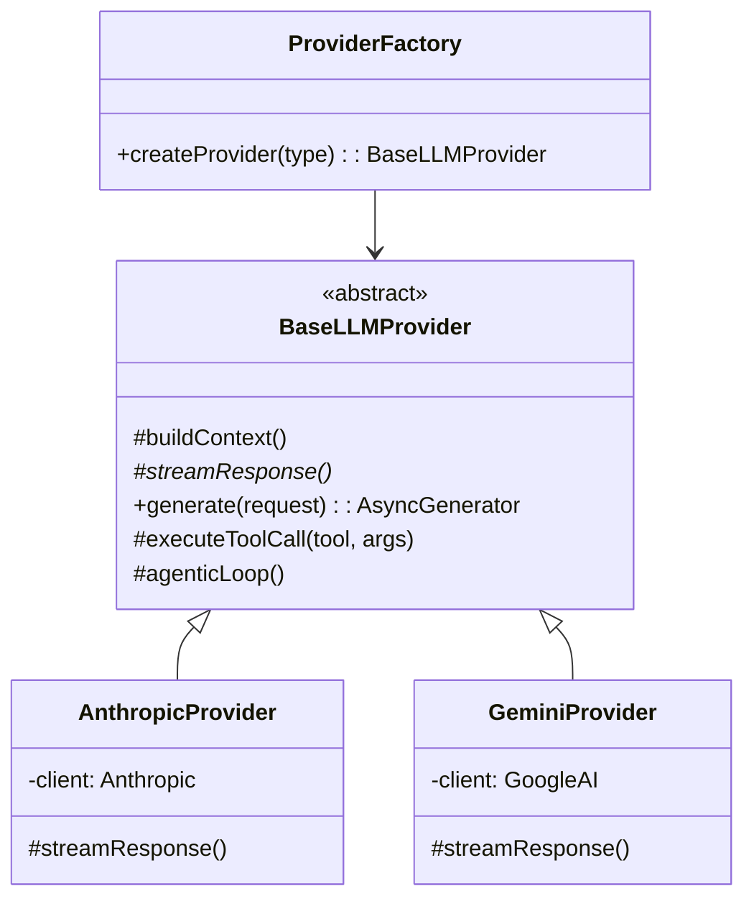
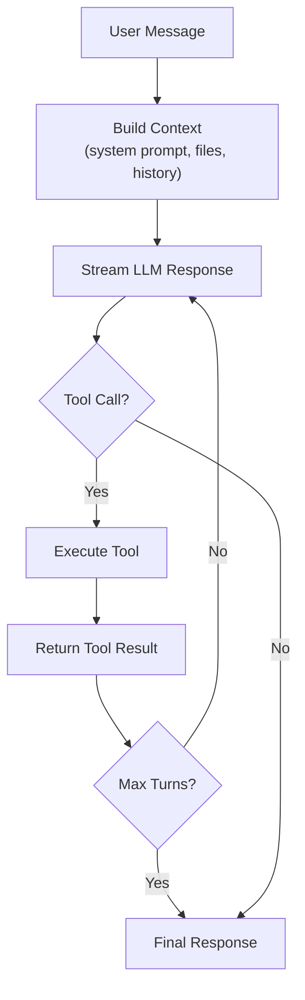
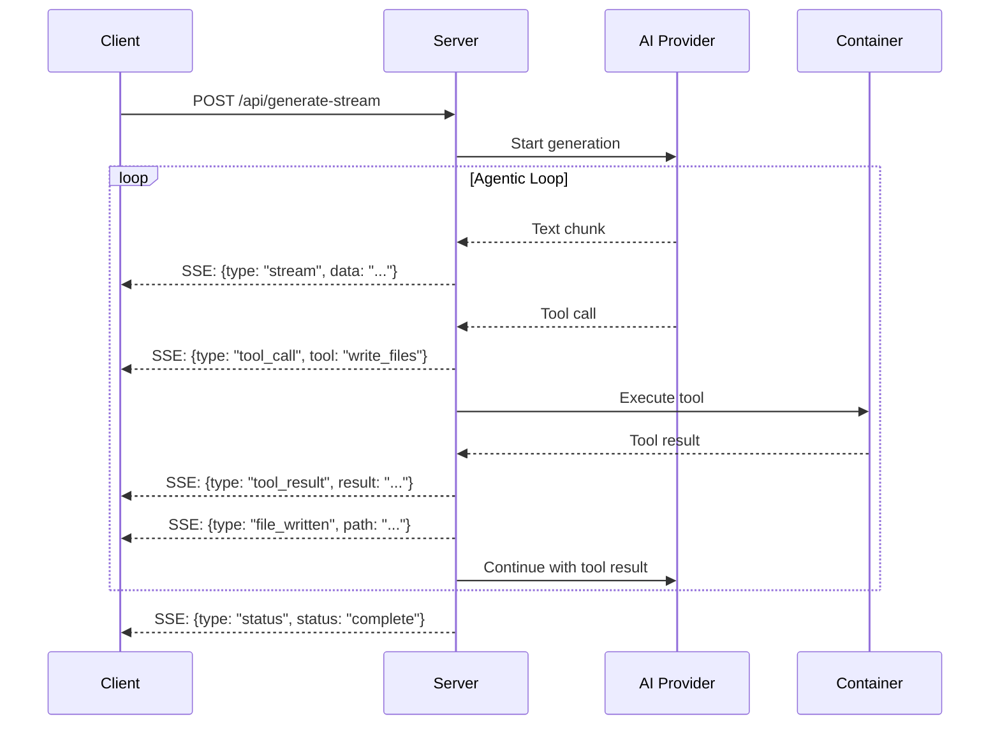
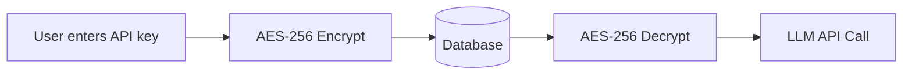

# AI Provider System

The AI provider system is the core of Adorable's code generation capabilities. It implements an agentic loop pattern where the AI iteratively generates code, executes tools, and refines results.

## Provider Architecture

## Agentic Loop

The agentic loop in `BaseLLMProvider`:

1. **Build Context** — Assembles system prompt with project context, file contents, chat history, and conditional skill instructions
2. **Stream Response** — Calls the LLM API with streaming enabled
3. **Tool Execution** — If the LLM calls a tool, executes it and feeds the result back
4. **Iterate** — Continues until the LLM produces a final text response or hits max turns

## Available Tools

Tools are defined in `providers/tools.ts` and `providers/kit-tools.ts`:

| Tool | Description |
|------|-------------|
| `read_files` | Read one or more project files |
| `write_files` | Write/create project files |
| `run_command` | Execute shell commands in the container |
| `search_files` | Search file contents with regex |
| `list_files` | List directory contents |
| `delete_files` | Delete project files |

Kit-specific tools extend this set with component library awareness.

## Streaming Protocol (SSE)

### SSE Event Types

| Event Type | Description |
|------------|-------------|
| `stream` | Text chunk from the AI |
| `tool_call` | AI is calling a tool |
| `tool_result` | Result of tool execution |
| `file_written` | A file was created or modified |
| `status` | Generation status updates |

## Skill System

Conditional system prompt additions in `providers/skills/` inject specialized instructions based on context:

- Component kit instructions (PrimeNG, Angular Material, etc.)
- Figma design-to-code instructions
- Project-type-specific patterns

## User API Keys

Users provide their own AI API keys, stored AES-256 encrypted in the database. Keys are decrypted at request time and never logged.

