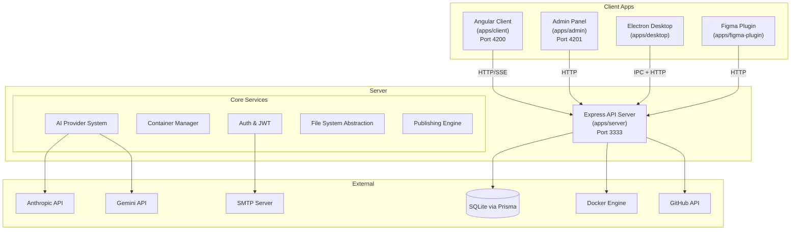

# Adorable — Architecture Overview

Adorable is an AI-powered IDE for Angular that lets users build, preview, and deploy full-stack Angular apps via natural language. This document provides a high-level view of the system architecture.

## System Architecture



## Monorepo Layout

```
adorable/
├── apps/
│   ├── client/          # Angular 21 SPA — main IDE UI
│   ├── server/          # Express API — AI, containers, auth
│   ├── admin/           # Admin dashboard (Angular)
│   ├── desktop/         # Electron shell
│   └── figma-plugin/    # Figma design export
├── libs/
│   └── shared-types/    # TypeScript interfaces (@adorable/shared-types)
├── prisma/              # SQLite schema & migrations
├── docs/                # Documentation
└── nx.json              # Nx workspace configuration
```

## Key Design Decisions

- **Zoneless Angular**: The client uses `provideZonelessChangeDetection()` — all reactive state must use Angular signals
- **Standalone Components**: No NgModules; every component is standalone
- **Bring Your Own Key**: Users provide their own AI API keys (stored AES-256 encrypted)
- **Container Abstraction**: Same codebase runs locally (Docker) or natively (Electron IPC)
- **SSE Streaming**: AI generation streams via Server-Sent Events for real-time feedback
- **SQLite + Prisma**: Lightweight, file-based database with typed ORM

## Related Documentation

- [Client Architecture](./client-architecture.md)
- [Server Architecture](./server-architecture.md)
- [AI Provider System](./ai-provider-system.md)
- [Authentication & Authorization](./auth-system.md)
- [Container & File System](./container-filesystem.md)
- [Database Schema](./database-schema.md)
- [Desktop & Cloud Sync](./desktop-cloud-sync.md)
- [Publishing & Deployment](./publishing-deployment.md)
