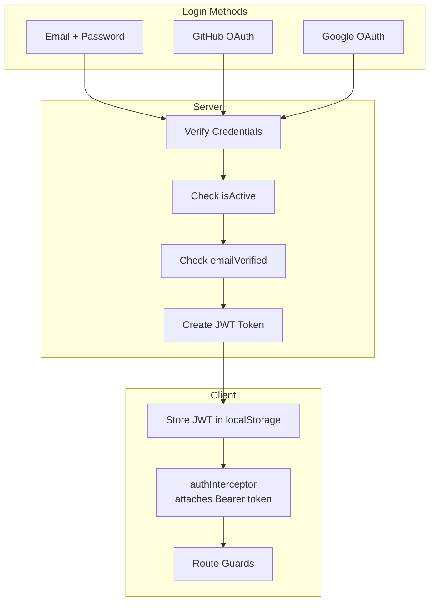
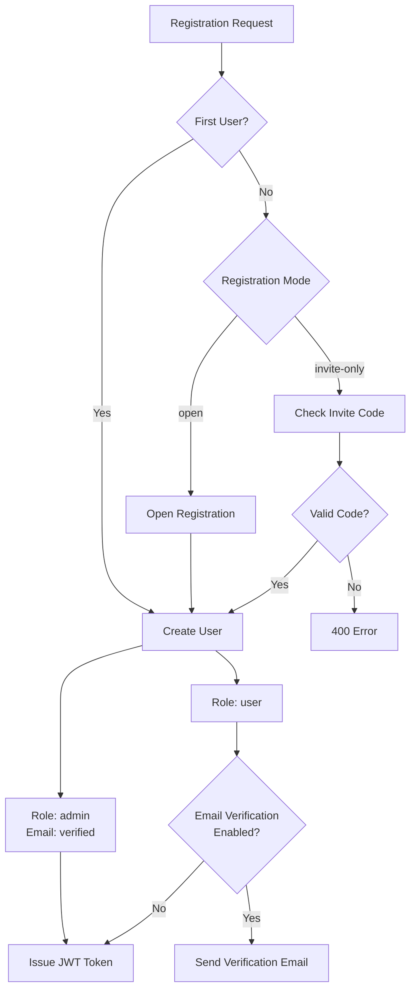
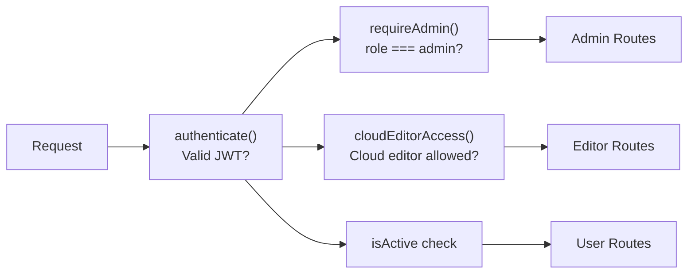
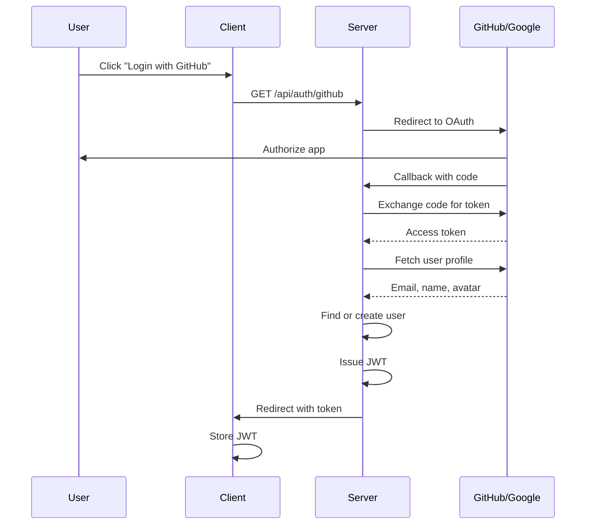
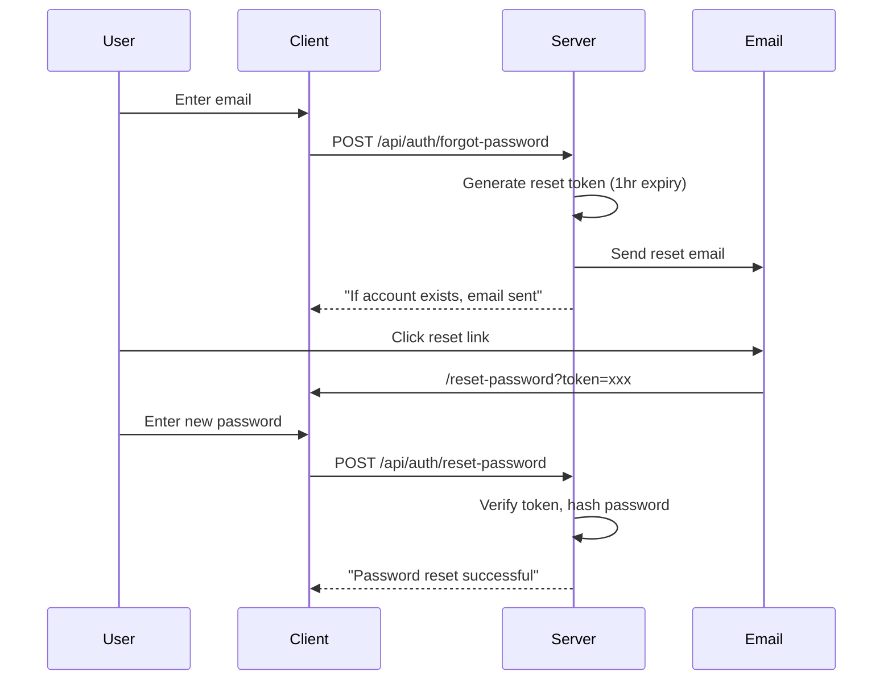

# Authentication & Authorization

Adorable supports multiple authentication methods: email/password, GitHub OAuth, and Google OAuth. Authorization is role-based with admin and user roles.

## Authentication Flow



## Registration Modes



- The **first user** always becomes admin with verified email
- Subsequent users follow the configured registration mode
- Invite codes are single-use with optional expiry

## JWT Token Structure

```json
{
  "userId": "string",
  "role": "admin | user",
  "iat": 1234567890,
  "exp": 1234567890
}
```

Tokens expire after 7 days. The `authenticate` middleware in `middleware/auth.ts` validates tokens and attaches the user to `req.user`.

## Authorization Layers



| Layer | Middleware | Purpose |
|-------|-----------|---------|
| Authentication | `authenticate()` | Verifies JWT, loads user |
| Admin Access | `requireAdmin()` | Checks `role === 'admin'` |
| Cloud Editor | `cloudEditorAccess()` | Checks allowlist mode |
| Account Status | `isActive` check | Disabled accounts blocked |
| Email Verified | `emailVerified` check | Unverified blocked at login |

## Social Login (OAuth)



Social login users get a random password hash (they can set a password later via reset flow). If a user with the same email already exists, the accounts are linked.

## Password Reset



## Rate Limiting

- **Login**: Rate limited via `authRateLimit` (prevents brute force)
- **Register**: Rate limited via `registerRateLimit`
- **Password Reset**: Rate limited via `authRateLimit`
