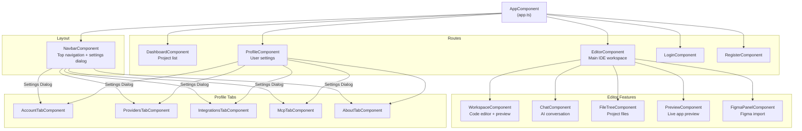
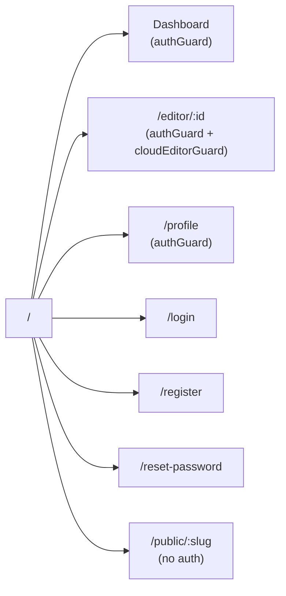
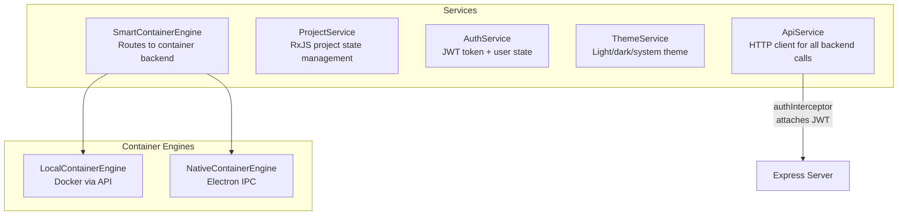
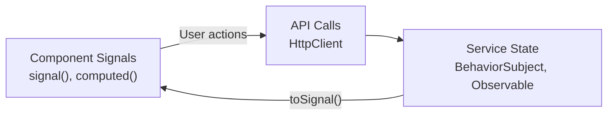

# Client Architecture

The main Angular client (`apps/client`) is the IDE frontend — a single-page application built with Angular 21, standalone components, and signals-based state management.

## Component Hierarchy

## Routing

Routes are defined in `app.routes.ts`. Protected routes use `authGuard` (checks JWT token) and `cloudEditorGuard` (checks cloud editor access).

## Core Services

### Key Services

| Service | Purpose |
|---------|---------|
| `ApiService` | HTTP client wrapping all backend endpoints. Uses Angular's `HttpClient` with `authInterceptor` for JWT. |
| `ProjectService` | Manages active project state (files, messages, loading) via RxJS BehaviorSubjects. |
| `AuthService` | Handles login/register/logout, stores JWT in localStorage, exposes `isAuthenticated()` signal. |
| `ThemeService` | Manages theme (light/dark/system) with CSS variable swapping. |
| `SmartContainerEngine` | Detects environment and routes container operations to Docker (web) or Electron IPC (desktop). |
| `CloudSyncService` | Desktop-only service for syncing projects to a remote Adorable server. Uses raw `fetch()` instead of Angular HttpClient. |

## State Management

The app uses Angular signals for component-level state and RxJS for service-level state. There is no global store (NgRx/etc).

## In-Editor Settings Dialog

The navbar includes a settings dialog that embeds all profile tab components, allowing users to change AI provider settings, account details, integrations, and MCP configuration without leaving the editor. The dialog is rendered outside the `<nav>` element to avoid CSS stacking context issues caused by `backdrop-filter`.
