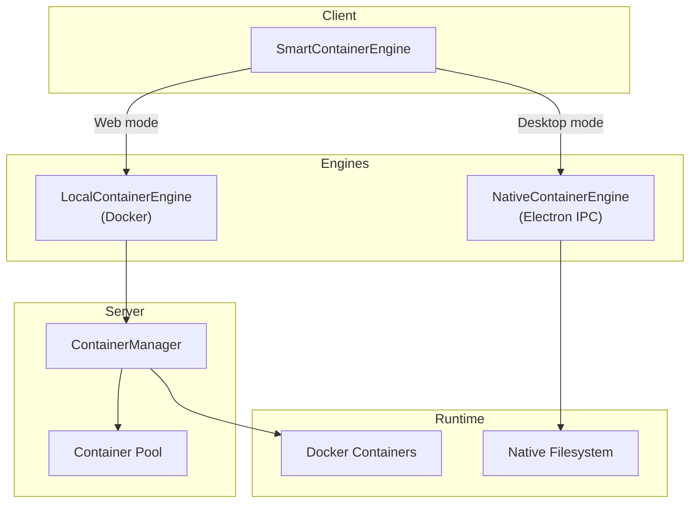
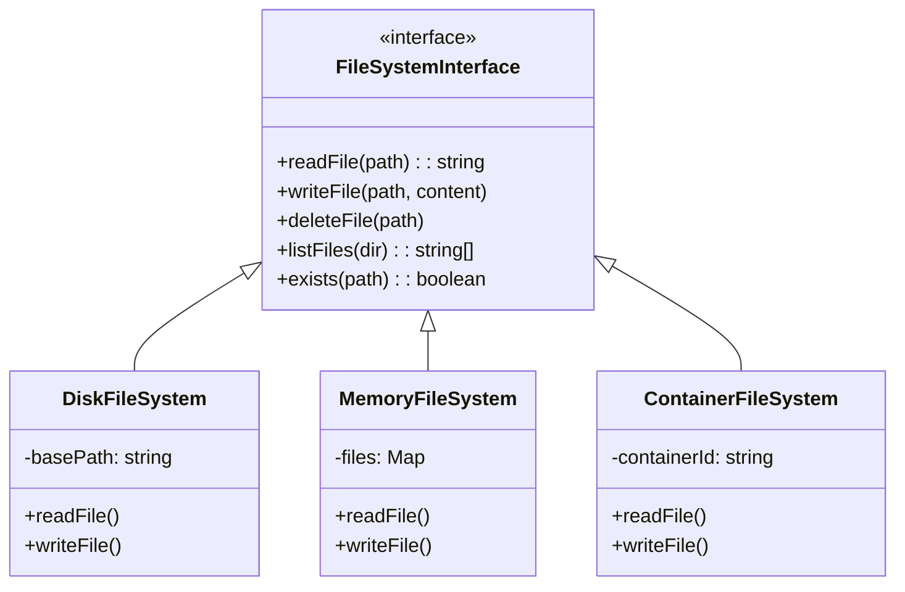
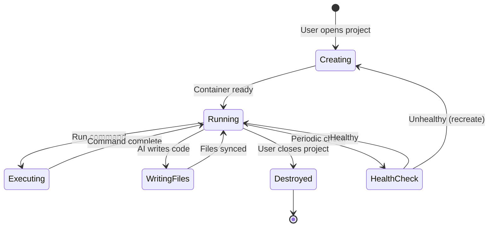

# Container & File System

Adorable uses a container abstraction to provide isolated environments for building and previewing Angular projects. The file system layer provides a unified interface across different storage backends.

## Container Architecture

### SmartContainerEngine

The `SmartContainerEngine` on the client detects the runtime environment and routes operations:

- **Web/Cloud mode** → `LocalContainerEngine` → Docker containers via server API
- **Desktop mode** → `NativeContainerEngine` → Direct filesystem access via Electron IPC

## File System Abstraction

| Implementation | Backend | Use Case |
|---------------|---------|----------|
| `DiskFileSystem` | Local disk | Desktop mode, server-side file ops |
| `MemoryFileSystem` | In-memory Map | Fallback, testing, temporary storage |
| `ContainerFileSystem` | Docker/Native | Active project editing |

## Container Lifecycle

## Container Operations

Each container provides:

- **File I/O**: Read/write project files inside the container
- **Command Execution**: Run Angular CLI commands (`ng serve`, `ng build`, etc.)
- **Live Preview**: Forward dev server port for iframe preview
- **Package Management**: Install npm dependencies
- **File Watching**: Detect changes for hot reload

## Docker Container Setup

When a new project container is created:

1. Pull/use base image with Node.js + Angular CLI
2. Initialize Angular project scaffold
3. Install dependencies
4. Start dev server
5. Expose preview port
6. Container is ready for AI code generation

## File Write Debouncing

Container file writes are debounced to avoid preview churn while the AI is actively writing multiple files. This prevents the Angular dev server from recompiling after every individual file change during a generation cycle.
