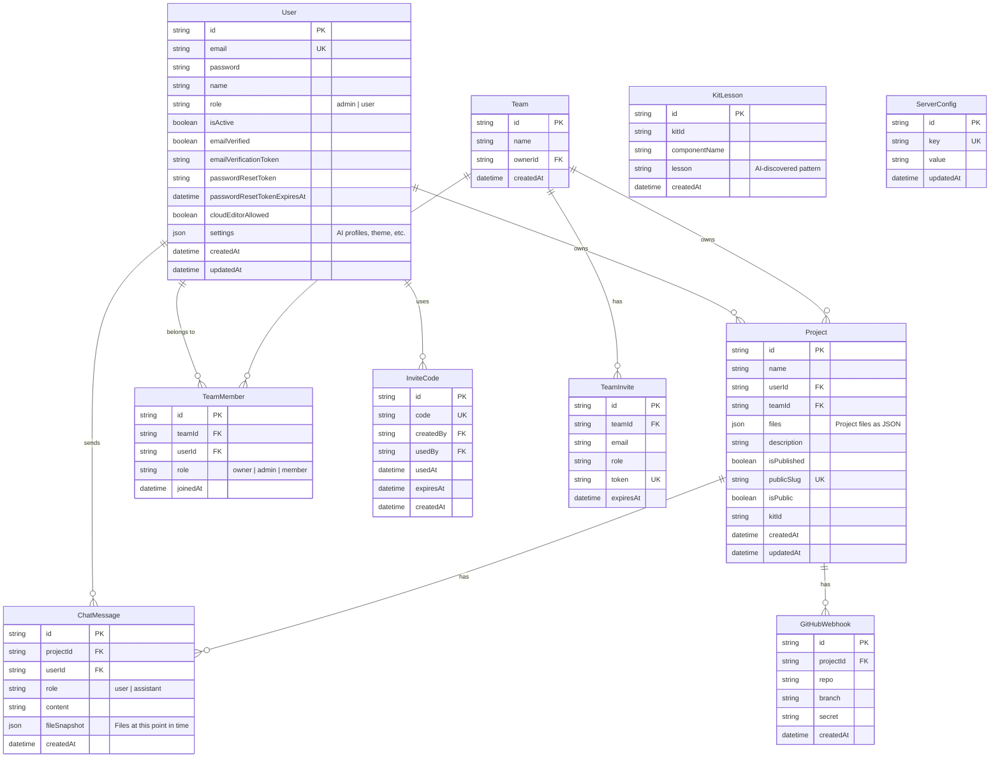

# Database Schema

Adorable uses SQLite via Prisma ORM. The schema is defined in `prisma/schema.prisma`.

## Entity Relationship Diagram

## Key Models

### User
Central user model with authentication fields, role-based access, and JSON settings (AI profiles, theme preferences, MCP server configs).

### Project
Stores project metadata and all files as a JSON string. Supports publishing with unique slugs for public/private sharing.

### ChatMessage
Stores conversation history with file snapshots at each message, enabling time-travel through project states.

### Team
Team workspace support with role-based membership (owner, admin, member) and invite system.

### ServerConfig
Key-value store for server-wide settings, cached in memory by `ServerConfigService`.

### KitLesson
AI-discovered patterns for component kits, learned during code generation and reused in future sessions.

## Desktop Database

The desktop app uses its own SQLite schema in `apps/desktop/db-init.ts` (not Prisma migrations). When modifying `prisma/schema.prisma`, you **must** also update `db-init.ts`:

1. Update `createFreshSchema()` with new columns/tables
2. Add a migration entry to the `migrations` array
3. Bump `LATEST_VERSION`
