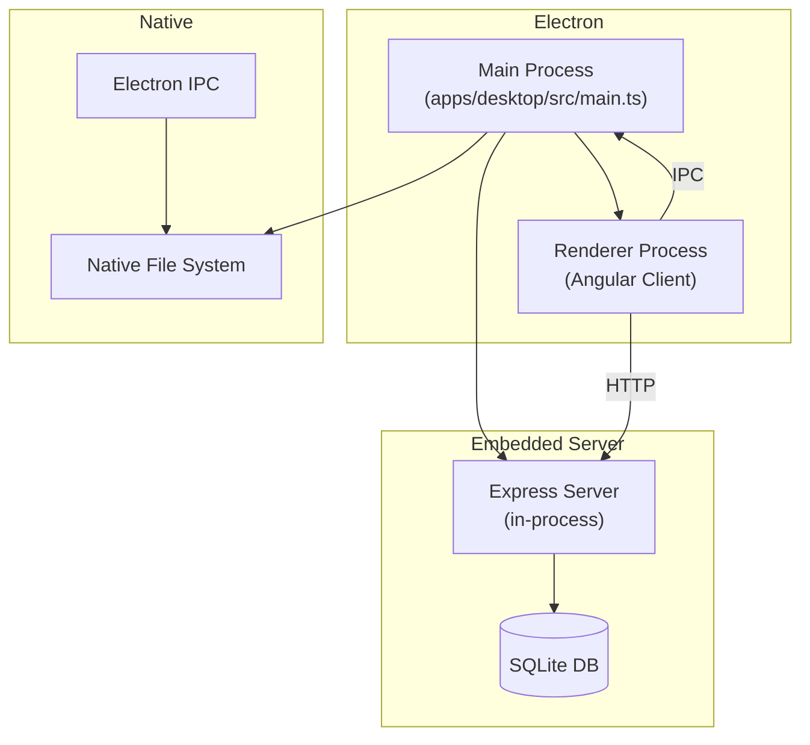
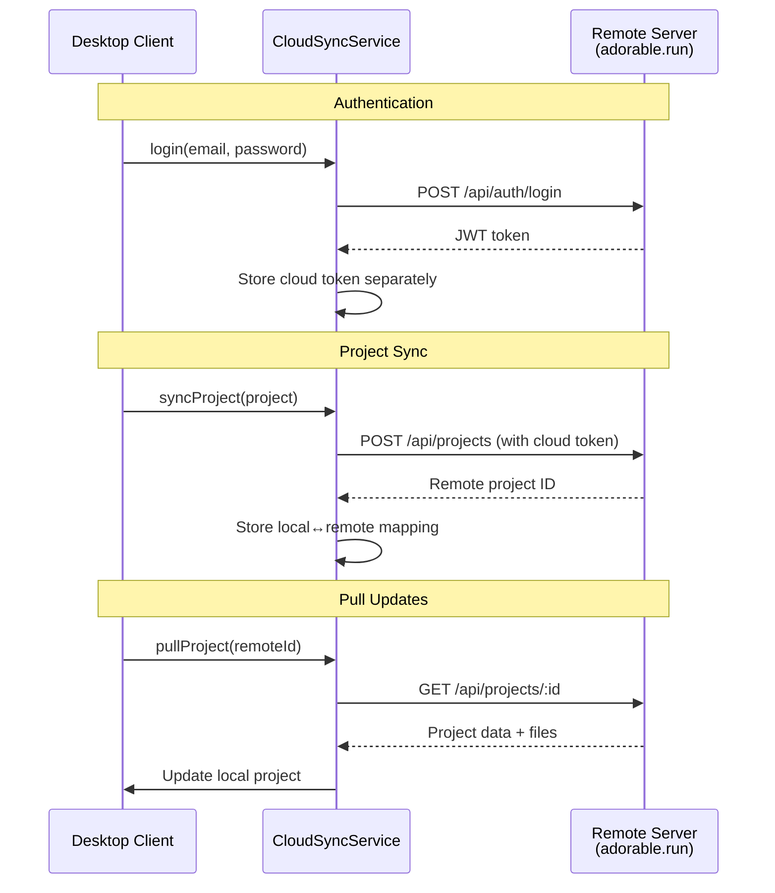
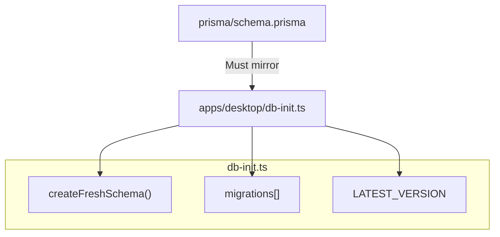
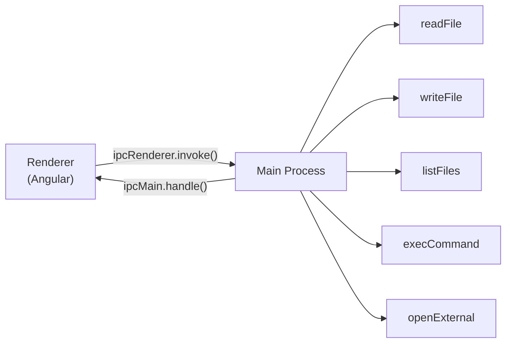

# Desktop & Cloud Sync

The Electron desktop app (`apps/desktop`) wraps the client and server into a standalone application. Cloud sync enables desktop users to sync projects with a remote Adorable server.

## Desktop Architecture

The desktop app:
- Bundles the Express server as an in-process module
- Uses its own SQLite database (managed by `db-init.ts`, not Prisma migrations)
- Exposes native file system access via Electron IPC
- Uses `NativeContainerEngine` instead of Docker

## Cloud Sync Flow

### Key Implementation Details

- **Separate tokens**: Cloud sync uses its own JWT token (stored separately from the local auth token) to authenticate with the remote server
- **Raw fetch**: `CloudSyncService` uses the browser's `fetch()` API directly instead of Angular's `HttpClient`, since the requests go to a different origin than the local server
- **Token storage**: Cloud token stored in localStorage under a different key than the local JWT
- **Error handling**: Network failures are handled gracefully — offline mode continues working

## Desktop Database Sync

The desktop app has its own database initialization system. Schema changes in Prisma must be manually replicated in `db-init.ts`.

## IPC Communication

The main process exposes file system and shell operations via IPC handlers. The `NativeContainerEngine` on the client calls these instead of Docker API endpoints.
