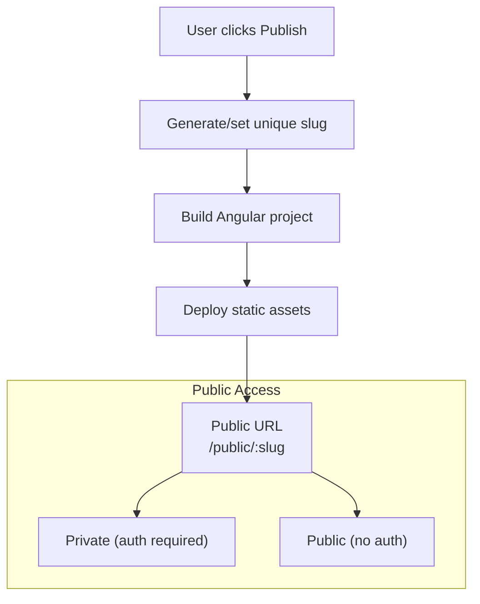
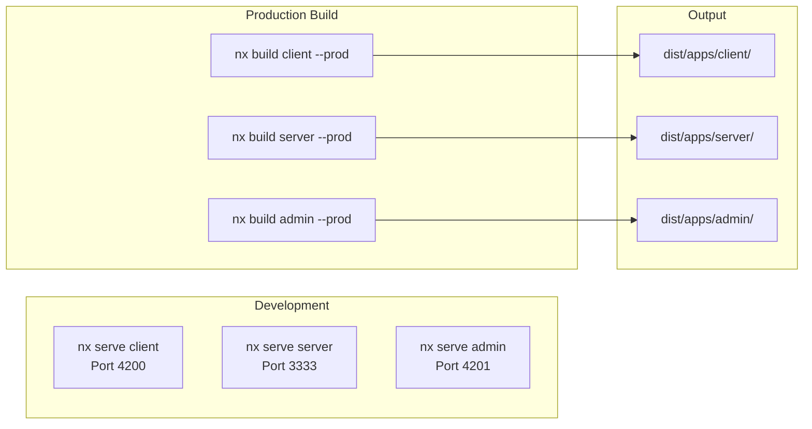
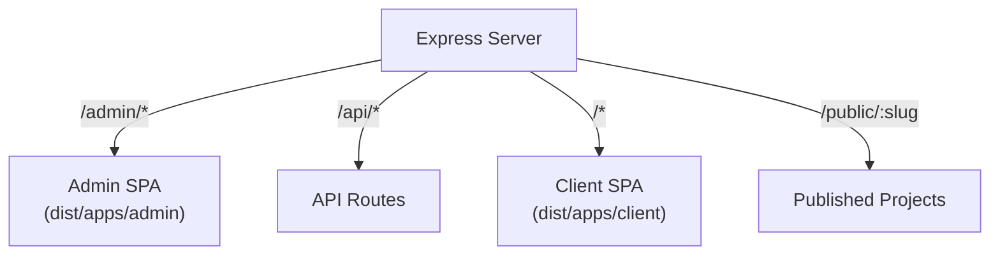
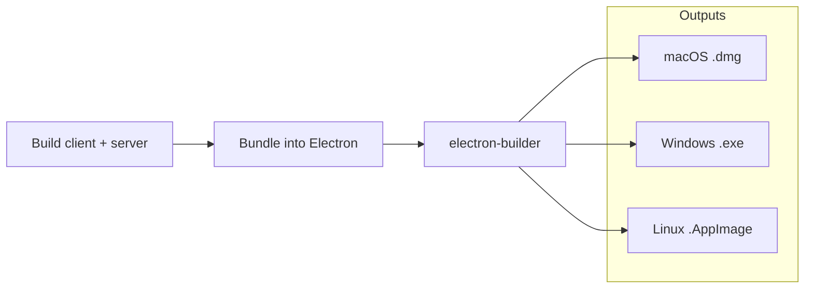
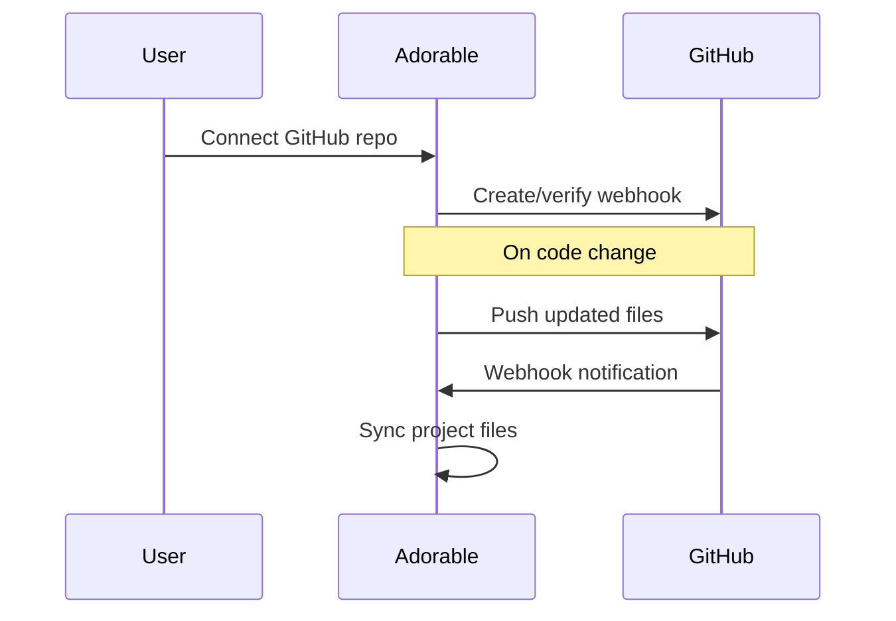

# Publishing & Deployment

Adorable supports publishing projects as live web apps with unique URLs, plus a full build and deployment pipeline.

## Publishing Flow

Projects can be published with:
- **Unique slug** — Human-readable URL identifier
- **Public/Private toggle** — Public projects accessible without authentication
- **Live preview** — Published apps are served as static Angular builds

## Build Pipeline

## Production Serving

In production, the Express server serves both the client and admin SPAs:

## Desktop Packaging

## GitHub Integration

Projects can be linked to GitHub repositories for version control. Webhooks enable bidirectional sync.
