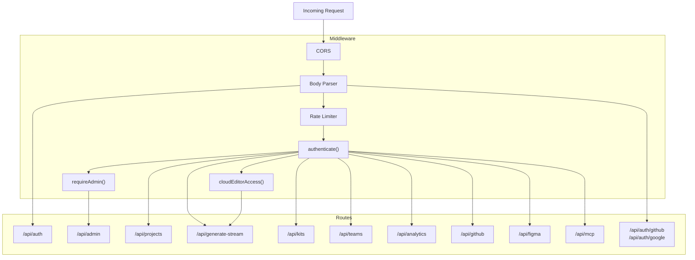
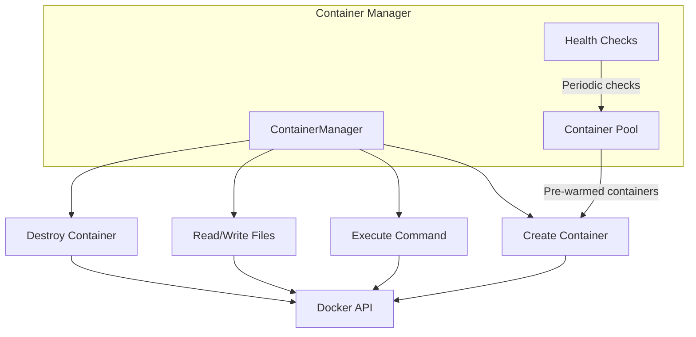

# Server Architecture

The Express server (`apps/server`) handles AI orchestration, container management, authentication, project persistence, and publishing.

## Request Flow

## Route Summary

| Route | Auth | Purpose |
|-------|------|---------|
| `/api/auth` | Public | Login, register, password reset, email verification |
| `/api/auth/github`, `/api/auth/google` | Public | OAuth social login flows |
| `/api/admin` | Admin | User management, invites, server config, stats |
| `/api/projects` | User | CRUD, publish/unpublish, public access |
| `/api/generate-stream` | User + Cloud | SSE AI generation (main endpoint) |
| `/api/kits` | User | Component kit discovery and lessons |
| `/api/teams` | User | Team workspaces, members, roles |
| `/api/analytics` | User | Token usage and cost tracking |
| `/api/github` | User | GitHub integration, webhooks |
| `/api/figma` | User | Figma design import |
| `/api/mcp` | User | Model Context Protocol servers |

## Server Configuration

Server-wide settings are stored in the `ServerConfig` database model and cached in memory by `ServerConfigService`. Settings include:

- `registration.mode` — `open` or `invite-only`
- `registration.emailVerification` — enable/disable email verification
- `cloudEditor.accessMode` — `open` or `allowlist`
- `cloudEditor.defaultAccess` — default access for new users

## Container Management

The container manager handles Docker container lifecycle for user projects. Each project gets an isolated container with Angular CLI installed, enabling live preview and command execution.

## Key Files

| File | Purpose |
|------|---------|
| `src/main.ts` | Server entry point, route mounting |
| `src/routes/auth.routes.ts` | Authentication endpoints |
| `src/routes/admin.routes.ts` | Admin panel API |
| `src/routes/project.routes.ts` | Project CRUD |
| `src/routes/generate.routes.ts` | AI generation SSE endpoint |
| `src/routes/social-auth.routes.ts` | GitHub/Google OAuth |
| `src/middleware/auth.ts` | JWT verification middleware |
| `src/middleware/admin.ts` | Admin role check |
| `src/middleware/rate-limit.ts` | Rate limiting config |
| `src/services/server-config.service.ts` | Cached server settings |
| `src/services/email.service.ts` | Nodemailer email sending |
| `src/services/container-manager.ts` | Docker container lifecycle |
