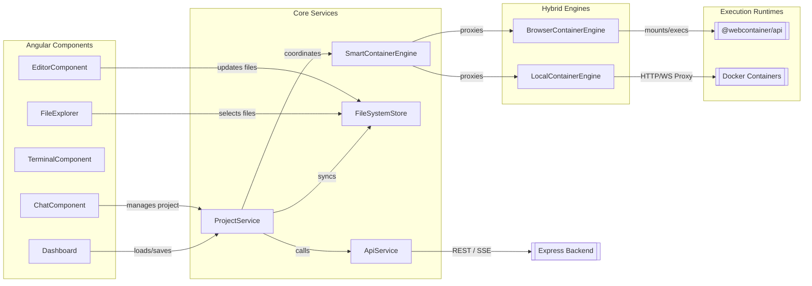
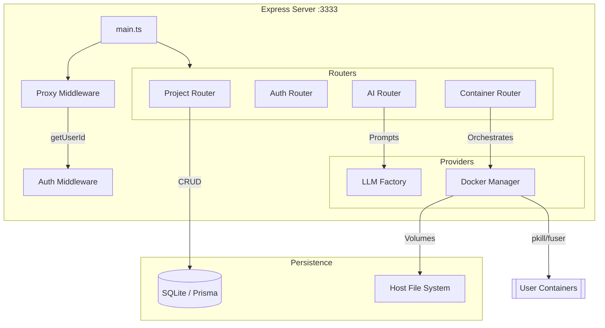
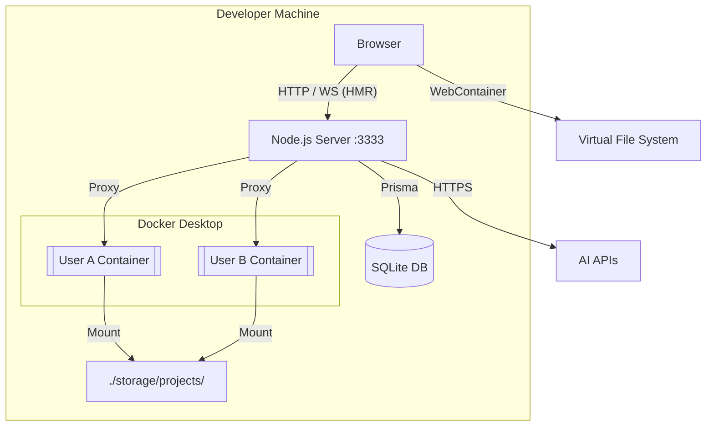
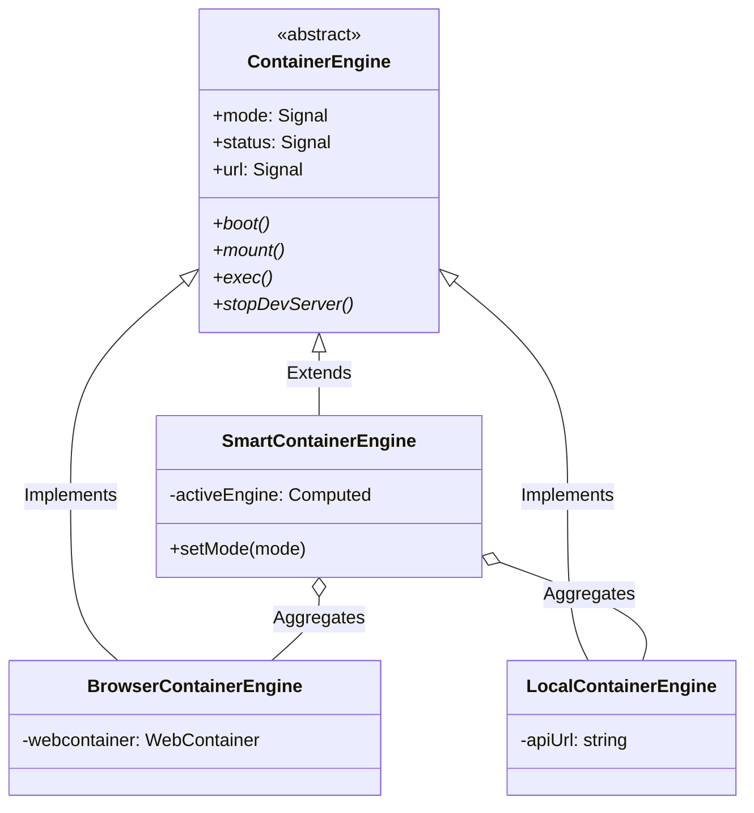
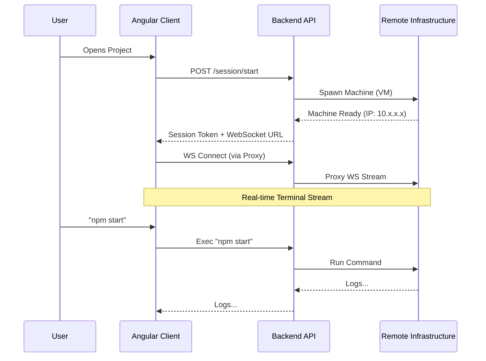

# Architecture Diagrams

## 1. Software Component Architecture (Frontend)

This diagram shows the relationship between UI components, core services, and the hybrid execution engines.

---

## 2. Backend Architecture (Modular)

The current refactored state of the Express server.

---

## 3. Infrastructure Architecture (Local)

The hybrid local environment using both in-browser virtualization and Docker.

---

## 4. Container Abstraction (Class Diagram)

The implemented abstraction for execution engines.

---

## 5. Remote Execution Flow (Future)

Proposed flow for remote Firecracker/MicroVM execution.

