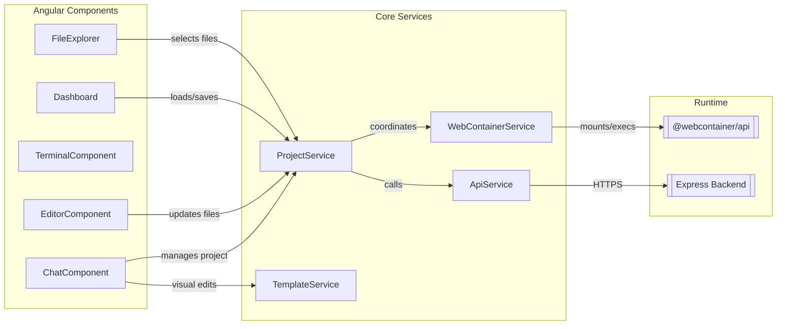
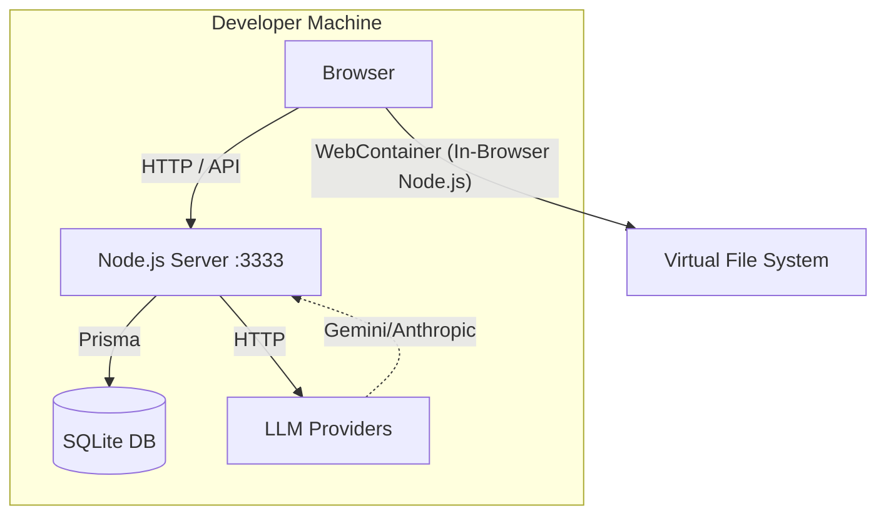
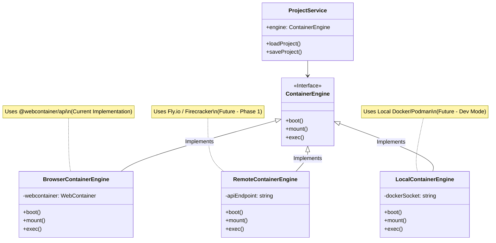
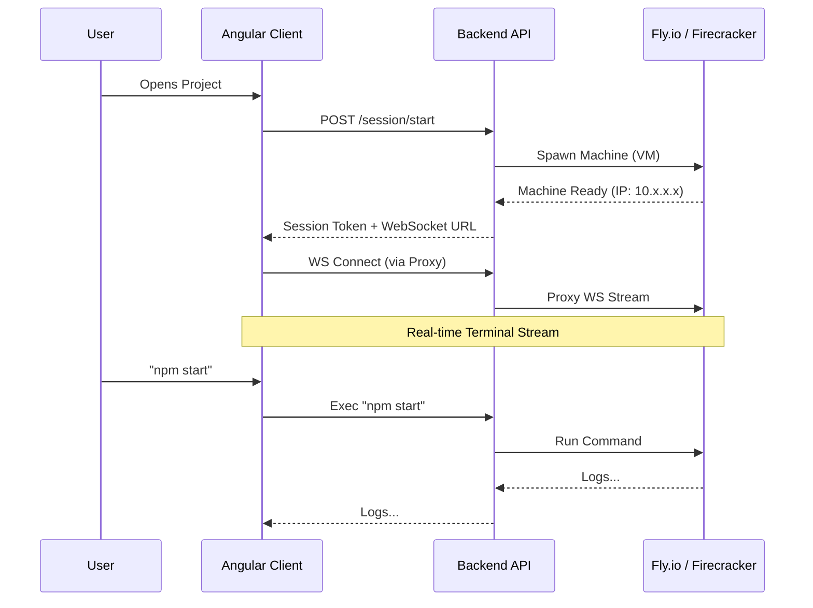

# Architecture Diagrams

## 1. Software Component Architecture (Today)

This diagram shows the relationship between UI components, core services, and external dependencies in the current codebase.



---

## 2. Infrastructure Architecture (Monolith / Local)

This represents the current state of the application running on your local machine.



---

## 2. Proposed Split Deployment (Production)

The target architecture for deployment on Render and GitHub Pages.

```mermaid
graph TD
    subgraph Client_Side [User's Browser]
        AngularApp[Angular App (GitHub Pages)]
        WC[WebContainer Runtime]
    end

    subgraph Backend [Render.com]
        APIServer[Node.js API Service]
        Postgres[(PostgreSQL DB)]
    end

    subgraph External
        Anthropic[Anthropic API]
        Google[Google Gemini API]
    end

    AngularApp -- "HTTPS (API)" --> APIServer
    AngularApp -- "Executes Code" --> WC
    
    APIServer -- "Read/Write" --> Postgres
    APIServer -- "Prompt" --> Anthropic
    APIServer -- "Prompt" --> Google
```

---

## 3. Future Container Abstraction (Hybrid Engine)

The proposed architecture to support both in-browser and server-side execution.



---

## 4. Remote Execution Flow (Sequence)

How the frontend interacts with a remote MicroVM backend.


