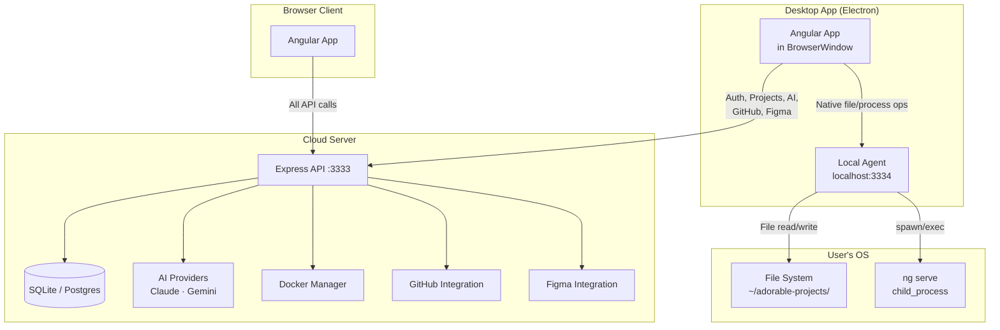
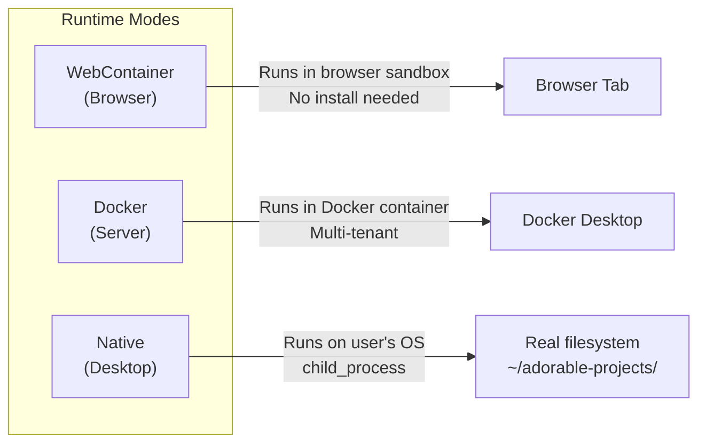
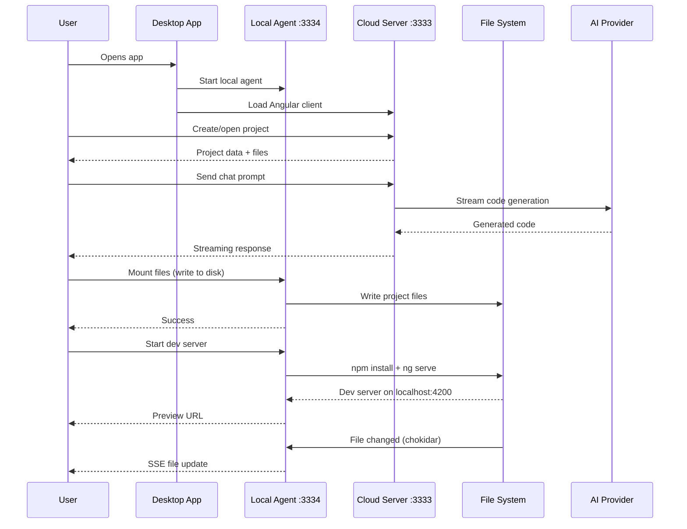

# Desktop App — Hybrid Architecture

## Overview

The Adorable desktop app is an Electron-based wrapper that provides native OS execution for Angular projects while sharing the same cloud server as the browser app. This means all projects, chat history, settings, and AI context are accessible from both desktop and browser.

## Architecture



## Three Runtime Modes



| Mode | Runtime | Where | Use Case |
|------|---------|-------|----------|
| **WebContainer** | Browser sandbox (StackBlitz) | Browser tab | Quick demos, no install |
| **Docker** | Docker container | Server-managed | Multi-tenant deployment |
| **Native** | OS child_process | User's machine | Desktop app, full local dev |

## Component Breakdown

### Cloud Server (`apps/server/`)

The existing Express server handles everything except native execution:

- **Auth** — User registration, login, JWT sessions
- **Projects** — CRUD, file snapshots, thumbnails
- **AI** — Streaming code generation via Claude/Gemini
- **Docker** — Container lifecycle for Docker mode
- **GitHub** — OAuth, repo sync, Pages deployment
- **Figma** — API proxy for design imports
- **Database** — SQLite via Prisma ORM

### Local Agent (`apps/desktop/local-agent.ts`)

A lightweight Express server (port 3334) that runs inside the Electron app. No database, no auth — it only handles native OS operations:

```
POST   /api/native/start        → Create project directory
POST   /api/native/stop         → Kill processes, cleanup
POST   /api/native/mount        → Write files to filesystem
POST   /api/native/exec         → Run command, return output
GET    /api/native/exec-stream  → Streaming command execution (SSE)
GET    /api/native/watch        → File watcher events (SSE)
GET    /api/native/info         → Project path info
```

### Desktop Shell (`apps/desktop/main.ts`)

Electron main process responsibilities:

1. **Bootstrap Node.js** — Auto-downloads portable Node.js if not found on system
2. **Start Local Agent** — Lightweight Express on port 3334
3. **Open BrowserWindow** — Points at the cloud server URL
4. **Expose Desktop API** — `window.electronAPI` for the Angular client to detect desktop mode

### Angular Client (`apps/client/`)

The same Angular app serves both browser and desktop. Detection logic:

```typescript
// SmartContainerEngine detects desktop mode
function getDefaultMode(): ContainerMode {
  if (window.electronAPI?.isDesktop) return 'native';
  return localStorage.getItem('container_mode') || 'browser';
}
```

In desktop mode:
- Mode selector is hidden (always native)
- Native API calls → `localhost:3334` (local agent)
- All other API calls → cloud server URL

## Data Flow



## Node.js Bootstrap

The desktop app needs Node.js for running `npm install` and `ng serve`. On first launch:

1. Check if `node` is on PATH
2. If not, check for previously downloaded bundled Node
3. If neither, prompt user to download Node.js (~50MB one-time)
4. Downloads to `app.getPath('userData')/node/`
5. Prepends to PATH for all child processes

## Configuration

| Setting | Env Variable | Default |
|---------|-------------|---------|
| Cloud server URL | `ADORABLE_SERVER_URL` | `http://localhost:3333` |
| Local agent port | `ADORABLE_AGENT_PORT` | `3334` |
| Projects directory | `ADORABLE_PROJECTS_DIR` | `~/adorable-projects/` |

## File Structure

```
apps/desktop/
├── main.ts              # Electron main process
├── preload.ts           # Exposes electronAPI to renderer
├── local-agent.ts       # Standalone Express for native ops
├── node-bootstrap.ts    # Auto-download Node.js
├── package.json         # Electron app manifest + builder config
├── project.json         # Nx project targets
└── tsconfig.json        # TypeScript config

apps/server/src/
├── providers/container/
│   ├── native-manager.ts    # NativeManager (reusable)
│   └── native-registry.ts   # Multi-user registry (server-side)
└── routes/
    └── native.routes.ts      # Native routes (reusable)

apps/client/src/app/services/
├── native-container.engine.ts  # Client-side native engine
├── smart-container.engine.ts   # Mode switcher (browser/docker/native)
└── container-engine.ts         # Abstract base class
```

## Build & Run

```bash
# Development (all local)
npx nx serve server          # Cloud server on :3333
npx nx serve client          # Angular dev server on :4200
npx tsc -p apps/desktop/tsconfig.json && npx electron dist/apps/desktop/main.js

# Production packaging
npx nx build desktop         # Compiles desktop TypeScript
npx nx package desktop       # Packages with electron-builder
```

## Cross-Platform Targets

| Platform | Format | Tool |
|----------|--------|------|
| macOS | `.dmg` | electron-builder |
| Windows | `.exe` (NSIS) | electron-builder |
| Linux | `.AppImage` | electron-builder |
