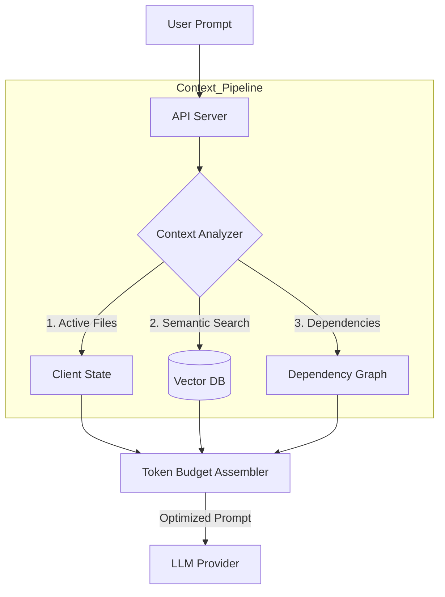

# Smart Context & RAG Architecture

## 1. The Problem
Currently, the application sends the **entire file structure** and potentially large chunks of code to the LLM on every request.
*   **High Cost:** Input tokens are expensive (Claude 3.5 Sonnet / GPT-4).
*   **Latency:** Large prompts take longer to process.
*   **Context Window Limits:** Large projects will eventually hit the 200k/1M token limit or degrade model performance ("lost in the middle" phenomenon).

## 2. Solution: Tiered Context Strategy

We will implement a tiered approach to context selection, moving from "Brute Force" to "Surgical Precision".

### Tier 1: The "Active Working Set" (Client-Side)
*   **Concept:** Prioritize what the user is looking at.
*   **Implementation:**
    *   Always include: `package.json`, `angular.json` (Configuration).
    *   Always include: **Currently Open Tabs** in the editor.
    *   Always include: **Selected/Highlighted Code**.
    *   **Heuristic:** If a user is editing `header.component.ts`, they likely need `header.component.html` and `header.component.scss`.

### Tier 2: Relevance Search (Basic RAG)
*   **Concept:** Find files relevant to the user's *prompt* ("Fix the login bug").
*   **Implementation:**
    1.  **Chunks:** Split source code into meaningful chunks (e.g., Functions, Classes).
    2.  **Embeddings:** Generate vector embeddings for these chunks (using `text-embedding-3-small` or local model).
    3.  **Vector Store:** Store these in a lightweight, in-memory vector DB (e.g., `HNSWLib` or `SQLite` with `vector` extension) on the server.
    4.  **Retrieval:** When the user asks a question, embed the question -> search the DB -> retrieve top 5 most relevant code chunks -> append to prompt.

### Tier 3: Tree-Sitter Dependency Graph (Advanced)
*   **Concept:** "If I change Function A, what breaks?"
*   **Implementation:**
    *   Use `tree-sitter` (on the server) to parse the code.
    *   Build a **Symbol Graph** (Imports, Exports, Usage).
    *   **Workflow:**
        *   User: "Update the User Interface."
        *   System: Finds `User` interface definition.
        *   Graph: Finds all files that *import* `User`.
        *   Context: Includes `user.model.ts` AND `profile.component.ts` automatically.

---

## 3. Architecture Diagram (Smart Context)

## 4. Implementation Roadmap

### Phase 1: "Explicit Context" (Low Effort, High Value)
*   **Feature:** Add a simple `@mentions` feature in the chat (e.g., `@login.ts`).
*   **Logic:** Only send the *file tree* (names only) + content of *specifically mentioned* or *open* files.
*   **Benefit:** Massive immediate token savings.

### Phase 2: "Vector Search" (Medium Effort)
*   **Feature:** "Search codebase" capability.
*   **Tech:** Add `pgvector` (since we are moving to Postgres) or use a sidecar `ChromaDB`.
*   **Logic:** Index the project on "Save". Query on "Generate".

### Phase 3: "AST Analysis" (High Effort)
*   **Feature:** Automated refactoring safety.
*   **Tech:** Integrate `tree-sitter` into the Node.js backend.

## 5. Recommendation
Start with **Phase 1 (Explicit Context)** immediately.
1.  Stop sending full file contents by default.
2.  Send **File Tree** (paths only).
3.  Send **Open Files** content.
4.  Allow LLM to use the `read_file` tool to "fetch" content it thinks it needs (Agentic RAG). This is the most natural pattern for your current agent setup.
